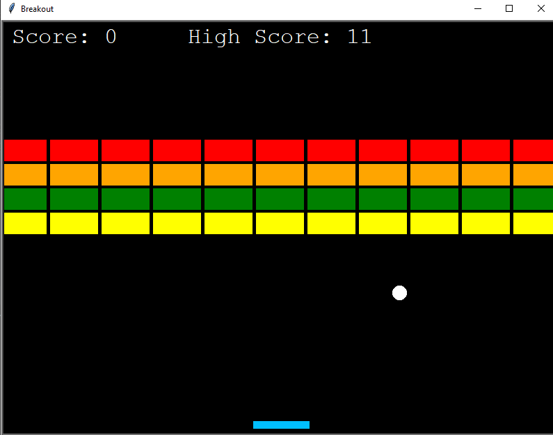

# Breakout
The classic 1972 Breakout Video game also known as Atari by Google. This is built with the python module called Turtle. Run the main.py file to play the game.
# Installation
### NO EXTERNAL LIBRARIES TO BE INSTALLED!
# Usage
- Use the Left Arrow Key and Right Arrow key to move the paddle!
- Make sure the ball does not go below the paddle!
# Preview

